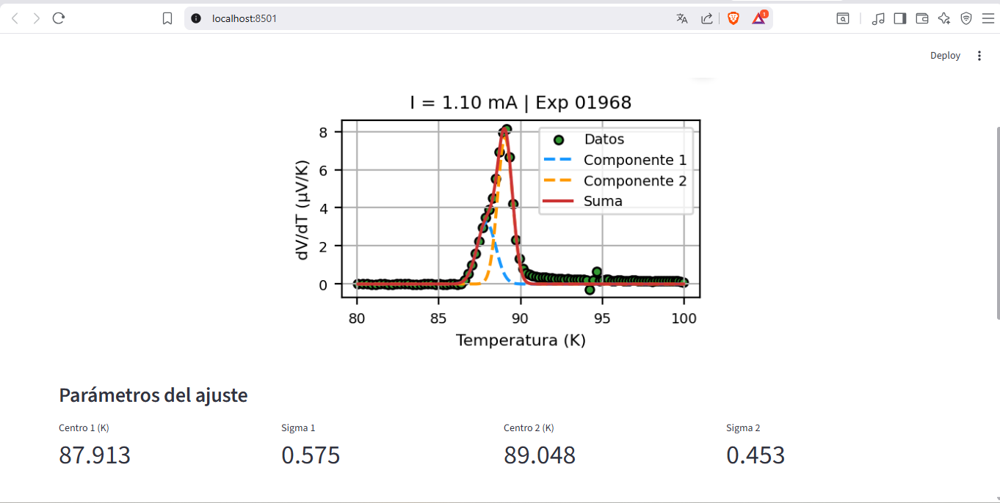
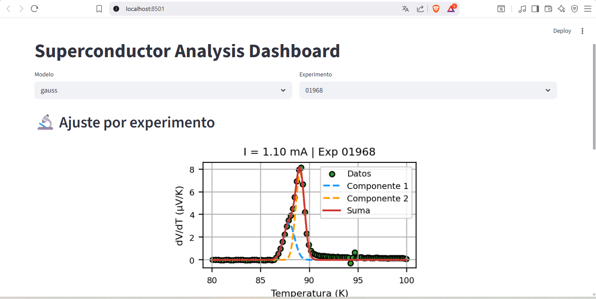
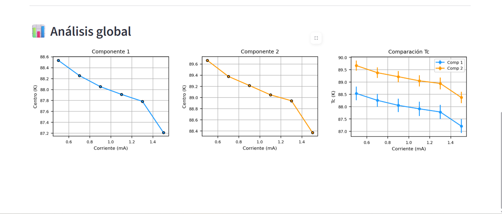

# Superconductor Data Analysis Dashboard

Interactive scientific dashboard for superconducting experimental data analysis using Python, numerical methods, and nonlinear curve fitting.

This project processes real superconducting transition measurements, applies double Gaussian and Lorentzian fitting models, and visualizes the results through an interactive Streamlit dashboard.

---

## Features

- Reads experimental `.Cn1` and `.Cn2` measurement files
- Computes average voltage and temperature
- Calculates numerical derivatives (`dV/dT`)
- Applies:
  - Double Gaussian fitting
  - Double Lorentzian fitting
- Interactive experiment selection
- Global Tc vs current analysis
- Error visualization
- Automatic scientific plotting

---

## Dashboard Preview

### Dashboard Overview



Main dashboard interface with interactive experiment and model selection.

---

### Experiment Analysis



The dashboard allows interactive visualization of the superconducting transition for each experiment, including:

- Raw experimental points
- Individual fitted components
- Total fitted curve
- Extracted fitting parameters

---

### Global Tc Analysis



Global analysis compares the evolution of the fitted critical temperatures as a function of applied current.

---

## Scientific Context

Unlike typical software portfolio projects, this repository focuses on scientific data analysis using real experimental measurements.

The workflow combines:

- Scientific computing
- Numerical analysis
- Curve fitting
- Data visualization
- Interactive dashboards
- Experimental physics

This project was developed as part of superconductivity data analysis research workflows.

---

## Technologies Used

- Python
- NumPy
- Pandas
- SciPy
- Matplotlib
- Streamlit
- OpenPyXL

---

## How to Run

Clone the repository:

```bash
git clone https://github.com/Axahdz/superconductor-data-analysis-dashboard.git
cd superconductor-data-analysis-dashboard

Install dependencies:

```bash
pip install -r requirements.txt
```

Run the dashboard:

```bash
python -m streamlit run app.py
```

The application will open automatically in your browser at:

```text
http://localhost:8501
```

---

## Project Structure

```text
superconductor-data-analysis-dashboard/
│
├── app.py
├── main.py
├── requirements.txt
├── README.md
├── .gitignore
├── LICENSE
│
├── screenshots/
│   ├── dashboard_main_view.png
│   ├── experiment_fit_view.png
│   └── global_analysis_view.png
│
├── Run0_*.Cn1
└── Run0_*.Cn2
```

---

## Analysis Overview

The analysis focuses on the superconducting transition region between approximately 80 K and 100 K.

The numerical derivative enhances the transition signal, allowing more precise extraction of critical temperatures through nonlinear fitting methods.

Both Gaussian and Lorentzian models are supported for comparative analysis.

---

## Author

Javier Axayácatl Melchor Hernández

Background in Physics with experience in:

- Scientific computing
- Data analysis
- Python development
- Numerical modeling
- Experimental data visualization
